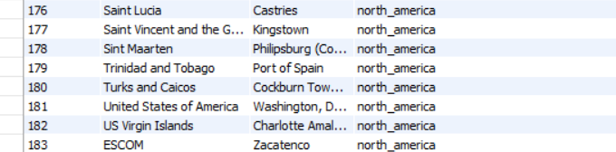

**Stpes**

1. Run MySQL and the script for insert data.
2. Run Spring Boot App

---

## Use
By continent:
```sh
http://localhost:8080/api/countries/continent/name/NORTH_AMERICA
```
By ID:
```sh
http://localhost:8080/api/countries/continent/id/180
```

GET all:
```sh
http://localhost:8080/api/countries/all
```

POST Country:
```sh
http://localhost:8080/api/countries/addCountry?name=ESCOM&capital=Zacatenco&continent=north_america
```



---
